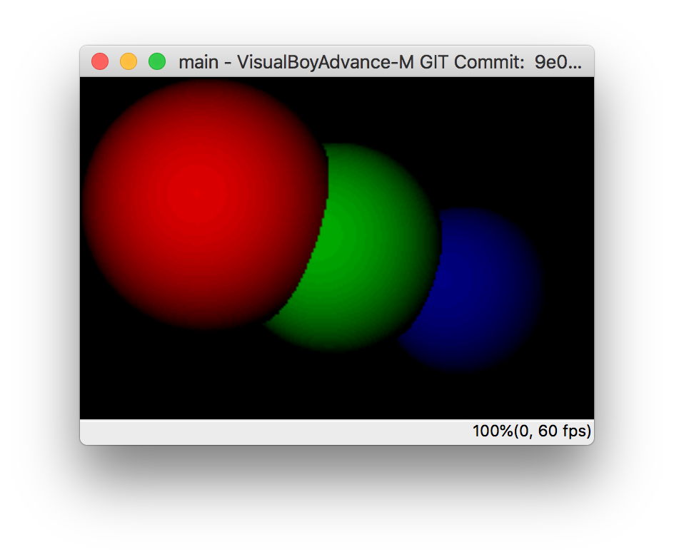

# gba-raytracer
Simple Raytracer for the Gameboy Advance written in C. Basically a port of [PurpleAlienPlanet's raytracer](https://www.purplealienplanet.com/node/20) code. 

Needs [DevKitARM](https://devkitpro.org/wiki/Getting_Started) to be compiled.

